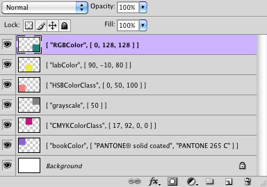

# Color Object Simplified Format

- Input format of `jamHelpers.toColorObject`.
- Output format of `jamHelpers.fromColorObject`.

## Explicit format

Defined as a JSON object:

Color&nbsp;class | JSON&nbsp;object
-----------------|-----------------
**Book color** | <code>{ "book": <em>book</em>, "name": <em>name</em>, "bookID": <em>bookID</em>, "bookKey": <em>bookKey</em> }</code><br>or<br><code>{ "book": <em>book</em>, "name": <em>name</em> }</code><br>or<br><code>{ "bookID": <em>bookID</em>, "bookKey": <em>bookKey</em> }</code>
**CMYK color** | <code>{ "cyan": <em>cyan</em>, "magenta": <em>magenta</em>, "yellowColor": <em>yellowColor</em>, "black": <em>black</em> }</code>
**Grayscale** | <code>{ "gray": <em>gray</em> }</code>
**HSB color** | <code>{ "hue": <em>hue</em>, "saturation": <em>saturation</em>, "brightness": <em>brightness</em> }</code>
**Lab color** | <code>{ "luminance": <em>luminance</em>, "a": <em>a</em>, "b": <em>b</em> }</code>
**RGB color** | <code>{ "red": <em>red</em>, "green": <em>green</em>, "blue": <em>blue</em> }</code>

> *book* : string
> <br>
> *name* : string
> <br>
> *bookID* : number
> <br>
> *bookKey* : string 

> *cyan* : number (percentage; 0% to 100%)
> <br>
> *magenta* : number (percentage; 0% to 100%)
> <br>
> *yellowColor* : number (percentage; 0% to 100%)
> <br>
> *black* : number (percentage; 0% to 100%)  

> *gray* : number (percentage; 0% to 100%)

> *hue* : number (0° to 360°)
> <br>
> *saturation* : number (percentage; 0% to 100%)
> <br>
> *brightness* : number (percentage; 0% to 100%)

> *luminance* : number (0 to 100)
> <br>
> *a* : number (-128 to 127)
> <br>
> *b* : number (-128 to 127)

> *red* : number (0 to 255)
> <br>
> *green* : number (0 to 255)
> <br>
> *blue* : number (0 to 255)

## Minimal format

Defined as a two-element JSON array: <code>[ <em>colorClass</em>, <em>colorComponents</em> ]</code>

> *colorClass* : string (among `"bookColor"`, `"CMYKColorClass"`, `"grayscale"`, `"HSBColorClass"`, `"labColor"`, `"RGBColor"`)
> <br>
> *colorComponents* : JSON array whose length and contents depend on *colorClass* :

*colorClass* | *colorComponents*
-------------|------------------
`"bookColor"` | <code>[ <em>book</em>, <em>name</em>, <em>bookID</em>, <em>bookKey</em> ]</code><br>or<br><code>[ <em>book</em>, <em>name</em> ]</code><br>or<br><code>[ <em>bookID</em>, <em>bookKey</em> ]</code>
`"CMYKColorClass"` | <code>[ <em>cyan</em>, <em>magenta</em>, <em>yellowColor</em>, <em>black</em> ]</code>
`"grayscale"` | <code>[ <em>gray</em> ]</code><br>or<br><code><em>gray</em></code>
`"HSBColorClass"` | <code>[ <em>hue</em>, <em>saturation</em>, <em>brightness</em> ]</code>
`"labColor"` | <code>[ <em>luminance</em>, <em>a</em>, <em>b</em> ]</code>
`"RGBColor"` | <code>[ <em>red</em>, <em>green</em>, <em>blue</em> ]</code>

> *book* : string
> <br>
> *name* : string
> <br>
> *bookID* : number
> <br>
> *bookKey* : string 

> *cyan* : number (percentage; 0% to 100%)
> <br>
> *magenta* : number (percentage; 0% to 100%)
> <br>
> *yellowColor* : number (percentage; 0% to 100%)
> <br>
> *black* : number (percentage; 0% to 100%)  

> *gray* : number (percentage; 0% to 100%)

> *hue* : number (0° to 360°)
> <br>
> *saturation* : number (percentage; 0% to 100%)
> <br>
> *brightness* : number (percentage; 0% to 100%)

> *luminance* : number (0 to 100)
> <br>
> *a* : number (-128 to 127)
> <br>
> *b* : number (-128 to 127)

> *red* : number (0 to 255)
> <br>
> *green* : number (0 to 255)
> <br>
> *blue* : number (0 to 255)

## Examples

```json
{
    "book": "PANTONE® solid coated",
    "name": "PANTONE 265 C"
}
```

```json
{
    "cyan": 17,
    "magenta": 92,
    "yellowColor": 0,
    "black": 0
}
```

```json
{
    "gray": 50
}
```

```json
{
    "hue": 0,
    "saturation": 50,
    "brightness": 100
}
```

```json
{
    "luminance": 90,
    "a": -10,
    "b": 80
}
```

```json
{
    "red": 0,
    "green": 128,
    "blue": 128
}
```



```json
[ "bookColor", [ "PANTONE® solid coated", "PANTONE 265 C" ] ]
```

```json
[ "CMYKColorClass", [ 17, 92, 0, 0 ] ]
```

```json
[ "grayscale", [ 50 ] ]
```

```json
[ "HSBColorClass", [ 0, 50, 100 ] ]
```

```json
[ "labColor", [ 90, -10, 80 ] ]
```

```json
[ "RGBColor", [ 0, 128, 128 ] ]
```
