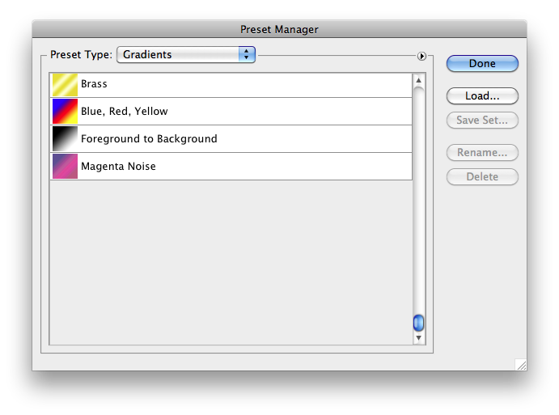

# Generate Gradients File

## Description

“Generate Gradients File” is a gradients utility script using the [JSON Action Manager](/JSON-Action-Manager) scripting library.

This stand-alone script written in JavaScript is used to generate a Photoshop gradients file (.grd) from a JSON text file containing a JSON array of gradient objects, each one in [Gradient Object Simplified Format](/JSON-Simplified-Formats/Gradient-Object-Simplified-Format).

From a technical point of view, it shows how to take advantage of the method `ActionDescriptor.toStream` to encode a flattened (serialized) version of an ActionDescriptor object saved in a file.

The utility script [Parse Gradients File](/Utility-Scripts/Parse-Gradients-File) performs the reverse operation, i.e., converts a Photoshop gradients file (.grd) into a JSON text file containing a JSON array of gradient objects in [Gradient Object Simplified Format](/JSON-Simplified-Formats/Gradient-Object-Simplified-Format).

Please refer to the [Photoshop Gradients File Format](/Documentation/Photoshop-Gradients-File-Format) page for detailed information about the structure of a gradients file.

## Example

**JSON text file (My Gradients.json) used as input to generate a gradients file**:

```json
[
    {
        "name": "Brass",
        "gradientForm": "customStops",
        "interpolation": 4096,
        "colors":
        [
            {
                "location": 0, "midpoint": 50, "type": "userStop",
                "color": { "red": 235, "green": 220, "blue": 35 }
            },
            {
                "location": 1024, "midpoint": 50, "type": "userStop",
                "color": { "red": 255, "green": 252, "blue": 194 }
            },
            {
                "location": 2048, "midpoint": 50, "type": "userStop",
                "color": { "red": 233, "green": 217, "blue": 28 }
            },
            {
                "location": 3072, "midpoint": 50, "type": "userStop",
                "color": { "red": 255, "green": 252, "blue": 200 }
            },
            {
                "location": 4096, "midpoint": 50, "type": "userStop",
                "color": { "red": 234, "green": 215, "blue": 32 }
            }
        ],
        "transparency":
        [
            { "location": 0, "midpoint": 50, "opacity": 100 },
            { "location": 4096, "midpoint": 50, "opacity": 100 }
        ]
    },
    {
        "name": "Blue, Red, Yellow",
        "gradientForm": "customStops",
        "interpolation": 4096,
        "colors":
        [
            {
                "location": 0, "midpoint": 50, "type": "userStop",
                "color": { "hue": 240, "saturation": 100, "brightness": 100 }
            },
            {
                "location": 2048, "midpoint": 50, "type": "userStop",
                "color": { "hue": 0, "saturation": 100, "brightness": 100 }
            },
            {
                "location": 4096, "midpoint": 50, "type": "userStop",
                "color": { "hue": 60, "saturation": 100, "brightness": 100 }
            }
        ],
        "transparency":
        [
            { "location": 0, "midpoint": 50, "opacity": 100 },
            { "location": 4096, "midpoint": 50, "opacity": 100 }
        ]
    },
    {
        "name": "Foreground to Background",
        "gradientForm": "customStops",
        "interpolation": 4096,
        "colors":
        [
            { "location": 0, "midpoint": 50, "type": "foregroundColor" },
            { "location": 4096, "midpoint": 50, "type": "backgroundColor" }
        ],
        "transparency":
        [
            { "location": 0, "midpoint": 50, "opacity": 100 },
            { "location": 4096, "midpoint": 50, "opacity": 100 }
        ]
    },
    {
        "name": "Magenta Noise",
        "gradientForm": "colorNoise",
        "randomSeed": 345807450,
        "showTransparency": false,
        "vectorColor": true,
        "smoothness": 1024,
        "colorSpace": "RGBColor",
        "minimum": [ 0, 18, 25, 0 ],
        "maximum": [ 100, 60, 73, 100 ]
    }
]
```

**Gradients displayed in the Preset Manager, after being loaded from the generated gradients file**:



## Requirements

This script can be used in Adobe Photoshop CS3 or later. It has been successfully tested in CS4 on Mac OS X, but should be platform agnostic.

## Copyright

This Software is copyright © 2011-2015 by Michel MARIANI.

## License

This Software is licensed under the [GNU General Public License (GPL) v3](https://www.gnu.org/licenses/gpl.html).

## Download

[Download Zip File](/Downloads/Generate-Gradients-File-4.3.zip)

## Installation

Download the Zip file and unzip it.

Move the script to the `Presets/Scripts` folder in the default preset location of the Adobe Photoshop application. On next launch, the script will appear in the File>Automate submenu.
