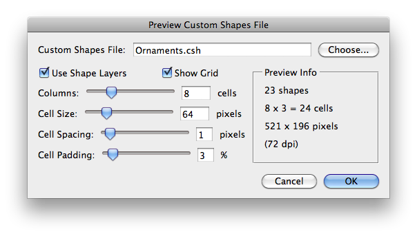
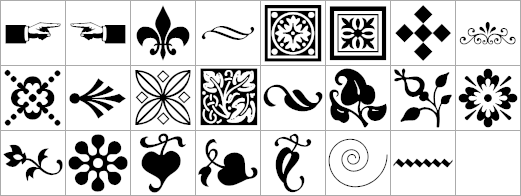

# Preview Custom Shapes File

## Description

“Preview Custom Shapes File” is a custom shapes files utility script using the [JSON Action Manager](/JSON-Action-Manager) scripting library, and more specifically its module `jamShapes`.

This stand-alone script written in JavaScript is used to graphically preview a Photoshop custom shapes file (.csh) or a custom shapes preferences file (CustomShapes.psp).

It creates a new image document with a white background and an optional grid layer, then generates a two-dimensional table of shape thumbnails, either drawn all in one single layer or displayed as a series of shape layers in a layer group.

Please refer to the [Photoshop Custom Shapes File Format](/Documentation/custom-shapes-file-format.html) document for detailed information about the structure of a custom shapes file.

A tool-tip displaying the full path name of the custom shapes file is available while hovering over the custom shapes file text field.

**Warning**: the time needed to generate the preview image document is logically proportional to the actual number of custom shapes in the file, but above all, it depends on how many control/anchor points the paths are made of. Occasionally, for some large sets of complex custom shapes, the generation can be particularly slow, i.e., may take more than half an hour…

## Example

**Preview image created from a custom shapes file (Ornaments.csh)**:

## Requirements

This script can be used in Adobe Photoshop CS3 or later. It has been successfully tested in CS4 on Mac OS X, but should be platform agnostic.

## Copyright

This Software is copyright © 2011-2015 by Michel MARIANI.

## License

This Software is licensed under the [GNU General Public License (GPL) v3](https://www.gnu.org/licenses/gpl.html).

## Download

[Download Zip File](/Downloads/Preview-Custom-Shapes-File-2.3.zip)

## Installation

Download the Zip file and unzip it.

Move the script to the `Presets/Scripts` folder in the default preset location of the Adobe Photoshop application. On next launch, the script will appear in the File>Automate submenu.
